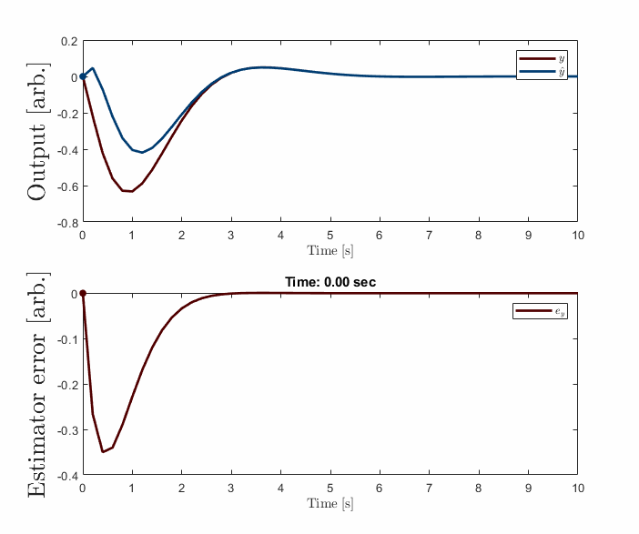
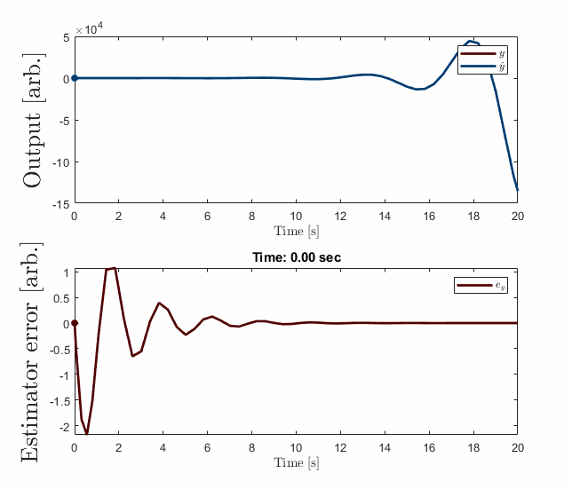

<!-- .slide: data-background="#003C71" class="dark" -->

# Adaptive Control is Not Complicated

## T. Griffith, Ph.D
#### Seminar Interview

#### July 30, 2022

---

<!-- .slide: data-background="#ffffff" class="light" -->
# ***Outline***

### 1. Why Study Adaptive Control?
### 2. Augmentation Example
### 3. Adaptive Control is Not Complicated
### 4. Adaptive Unknown Input Estimators
### 5. Some Applications of Note
### 6. Open Problems
### 7. Conclusions 

---
<!-- .slide: data-background="#003C71" class="dark" -->

# Why Study Adaptive Control?

---

<section>
<h1> Why Study Adaptive Control? </h1>
<h2> What this talk is and what it is not</h2>

<ul style="font-size:1.75vw">
<li style="padding-bottom:0.9em"> This talk is not:</li>
<ul>
  <li style="padding-bottom:0.9em"> An argument for adaptive control in every system always</li>
  <li style="padding-bottom:0.9em"> A chance for me to look smart by being confusing</li>
  <li style="padding-bottom:0.9em"> An overview of everything adaptive control</li>
  </ul>
</ul> 

<ul style="font-size:1.75vw">
<li style="padding-bottom:0.9em"> This talk is:</li>
<ul>
  <li style="padding-bottom:0.9em"> Something I like talking about</li>
  <li style="padding-bottom:0.9em"> Technically relevant</li>
  <li style="padding-bottom:0.9em"> Presents compelling theoretical challenges</li>
  </ul>
</ul> 

</section>

<section>
<h1> Why Study Adaptive Control? </h1>
<h2> Some perspectives </h2>

<ul style="font-size:1.3vw">
<li style="padding-bottom:0.9em">Classical vs. stochastic vs. adaptive control </li>
<li style="padding-bottom:0.9em"> Flight and Space Structure Needs:</li>
<ul>
  <li style="padding-bottom:0.9em"> Operating in a poorly known environment</li>
  <li style="padding-bottom:0.9em"> Are experiments equivalent to actual operation?</li>
  <li style="padding-bottom:0.9em"> Many degrees of freedom</li>
  <li style="padding-bottom:0.9em"> Finite element models are only as good as the physics</li>
  <li style="padding-bottom:0.9em"> Changing situations: takeoff, deployment, landing</li>
  <li style="padding-bottom:0.9em"> Control schemes based on reduced order models </li>
  </ul>
  <li style="padding-bottom:0.9em"> <strong><em>Greatly emphasizes local vs. global, linear vs. nonlinear thinking </em></strong></li>
</ul> 

<figure>
  
  <figcaption> Gambling in function space from [<a href="https://ntrs.nasa.gov/citations/19900011756">1</a>].</figcaption>
</figure>

</section>

<section>
<h1> Why Study Adaptive Control? </h1>
<h2> Defining an adaptive system</h2>

<ul style="font-size:1.3vw">
<li style="padding-bottom:0.9em">Conceptually: </li>
<ul>
  <li style="padding-bottom:0.9em"> A system with knowledge of its performance and the potency to improve it.</li>
  </ul>
  <li style="padding-bottom:0.9em"> OR, more mathematically</li>
  <ul>
<blockquote>A map $\mathcal{J}$ from $\mathcal{S}_r$ to $\mathcal{P}$ ($\mathcal{J}: \mathcal{S}_r \rightarrow \mathcal{P}$) with range $\mathcal{J}(\mathcal{S}) \subseteq \mathcal{P}_A$</blockquote>
  <li style="padding-bottom:0.9em">Remark: All systems are adaptive in this definition with respect to some $\mathcal{S}_r$ and $\mathcal{P}_A$  </li>
</ul> 

<figure>
  
  <figcaption>L. Zadeh, "Optimality and non-scalar-valued performance criteria [<a href="https://ieeexplore.ieee.org/abstract/document/1105511">2</a>].</figcaption>
</figure>

</section>

---
<!-- .slide: data-background="#003C71" class="dark" -->

# Augmentation example

---

<section>
<h1> Augmentation example </h1>
<h2> Recovering $\mathcal{P}_A$</h2>

<ul style="font-size:1.0vw">
<li style="padding-bottom:0.9em">Double integrator: </li>
<ul>
  <li style="padding-bottom:0.9em"> $\dot{x} = Ax+Bu, \ y=Cx$</li>
  <li style="padding-bottom:0.9em"> $A=\begin{bmatrix} 0 & 1 \\\ 0 & 0 \end{bmatrix}$, $B=\begin{bmatrix} 0 \\\ 1 \end{bmatrix}$, $C=\begin{bmatrix} 1 &1 \end{bmatrix}$</li>
  <li style="padding-bottom:0.9em"> Min. phase with $Z(A,B,C) = -1$</li>
  </ul>
  <li style="padding-bottom:0.9em"> Separation principle controller:</li>
  <ul>
  <li style="padding-bottom:0.9em"> $u = G\hat{x}$</li>
  <li style="padding-bottom:0.9em"> $\dot{\hat{x}}=A\hat{x} +Bu + K(y - \hat{y})$</li>
  <li style="padding-bottom:0.9em"> $\hat{y}=C \hat{x}$</li>
  </ul>
  <li style="padding-bottom:0.9em"> With set gains:</li>
  <ul>
  <li style="padding-bottom:0.9em"> $\sigma(A+BG) = -1 \pm j \Rightarrow G=\begin{bmatrix} -2 & -2 \end{bmatrix}$</li>
  <li style="padding-bottom:0.9em"> $\sigma(A-KC) = -2 \pm j \Rightarrow K=\begin{bmatrix} -1 & 5 \end{bmatrix}^T$</li>
  </ul>
</ul> 

<figure>
  
  <figcaption>Separation principle controller is stable.</figcaption>
</figure>

</section>

<section>
<h1> Augmentation example </h1>
<h2> Recovering $\mathcal{P}_A$</h2>

<ul style="font-size:1.0vw">
<li style="padding-bottom:0.9em">But <em><strong>suppose $A$ became $\tilde{A}$:</em></strong></li>
<ul>
  <li style="padding-bottom:0.9em"> $\dot{x} = \tilde{A}x+Bu, \ y=Cx$</li>
  <li style="padding-bottom:0.9em"> $\tilde{A}=\begin{bmatrix} 0 & 1 \\\ 0 & \color{red} 3 \end{bmatrix}$, $B=\begin{bmatrix} 0 \\\ 1 \end{bmatrix}$, $C=\begin{bmatrix} 1 &1 \end{bmatrix}$</li>
  <li style="padding-bottom:0.9em"> Min. phase with $Z(A,B,C) = -1$</li>
  </ul>
  <li style="padding-bottom:0.9em"> Separation principle controller:</li>
  <ul>
  <li style="padding-bottom:0.9em"> $u = G\hat{x}$</li>
  <li style="padding-bottom:0.9em"> $\dot{\hat{x}}=A\hat{x} +Bu + K(y - \hat{y})$</li>
  <li style="padding-bottom:0.9em"> $\hat{y}=C \hat{x}$</li>
  </ul>
  <li style="padding-bottom:0.9em"> With set gains:</li>
  <ul>
  <li style="padding-bottom:0.9em"> $\sigma(\tilde{A}+BG) = 0.5 \pm 1.3j \Rightarrow G=\begin{bmatrix} -2 & -2 \end{bmatrix}$</li>
  <li style="padding-bottom:0.9em"> $\sigma(\tilde{A}-KC) = -0.5 \pm 2.7j \Rightarrow K=\begin{bmatrix} -1 & 5 \end{bmatrix}^T$</li>
  </ul>
</ul> 

<figure>
  
  <figcaption>Perturbed separation principle controller is not stable.</figcaption>
</figure>

</section>

<section>
<h1> Augmentation example </h1>
<h2> Recovering $\mathcal{P}_A$</h2>

<ul style="font-size:1.0vw">
<li style="padding-bottom:0.9em">But suppose $A$ became $\tilde{A}$ and <em><strong>I have augmented the system with an adaptive outer loop:</em></strong></li>
<ul>
  <li style="padding-bottom:0.9em"> $\dot{x} = \tilde{A}x+Bu, \ y=Cx$</li>
  <li style="padding-bottom:0.9em"> $\tilde{A}=\begin{bmatrix} 0 & 1 \\\ 0 & \color{red} 3 \end{bmatrix}$, $B=\begin{bmatrix} 0 \\\ 1 \end{bmatrix}$, $C=\begin{bmatrix} 1 &1 \end{bmatrix}$</li>
  <li style="padding-bottom:0.9em"> Min. phase with $Z(A,B,C) = -1$</li>
  </ul>
  <li style="padding-bottom:0.9em"> Adaptive separation principle controller:</li>
  <ul>
  <li style="padding-bottom:0.9em"> $u = G\hat{x} + L y$</li>
  <li style="padding-bottom:0.9em"> $\dot{\hat{x}}=A\hat{x} +Bu + K(y - \hat{y})$</li>
  <li style="padding-bottom:0.9em"> $\hat{y}=C \hat{x}$</li>
  </ul>
  <li style="padding-bottom:0.9em"> With same set gains and adaptive law:</li>
  <ul>
  <li style="padding-bottom:0.9em"> $\dot{L} = -y y^T \sigma, \ \sigma>0$</li>
  </ul>
</ul> 

<figure>
  
  <figcaption>Adaptive separation principle controller is stable.</figcaption>
</figure>

</section>

<section>
<h1> Augmentation example </h1>
<h2> Recovering $\mathcal{P}_A$</h2>

<ul style="font-size:1.3vw">
<li style="padding-bottom:0.9em">Does this happen with gain scheduled controllers?</li>
<li style="padding-bottom:0.9em">We treated a significant constant perturbation adaptively</li>
<li style="padding-bottom:0.9em">Remark: Adaptive controllers are especially good at handling significant, slower disturbances</li>
<ul>
  <li style="padding-bottom:0.9em"> Robust controllers are especially good at small, fast disturbances</li>
  <li style="padding-bottom:0.9em"> $\therefore$ <em><strong> we should generally consider the adaptive augmentation of robust controllers.</em></strong></li>
  </ul>
</ul> 
</ul> 

<figure>
  
  <figcaption>Adaptive separation principle controller is stable.</figcaption>
</figure>

</section>

---

<!-- .slide: data-background="#003C71" class="dark" -->

# Adaptive Control is not Complicated

---

<section>
<h1> Adaptive Control is not Complicated </h1>

<ul style="font-size:1.3vw">
<li style="padding-bottom:0.9em">Given:</li>
<ul>
  <li style="padding-bottom:0.9em"> $ \begin{cases} \dot{x} &= Ax+Bu \\\ y&=Cx \end{cases}$</li>
  <li style="padding-bottom:0.9em"> $(A,B,C)$ ctrb/obsv (i.e. <em><strong>minimal</em></strong> description of $P(s)=C(sI-A)^{-1}B$)</li>
  </ul>
<li style="padding-bottom:0.9em">Recall Kimura-Davison sufficient conditions:</li>
<ul>
  <li style="padding-bottom:0.9em"> $M \equiv \text{rank }  B = \text{rank } C = M$ (square)</li>
  <li style="padding-bottom:0.9em"> $(A,B,C)$ ctrb/obsv</li>
  <li style="padding-bottom:0.9em"> $M\geq \frac{N+1}{2}; \ N=\dim x$</li>
  <ul>
  <li style="padding-bottom:0.9em"> `$\exists G_{\ast} \ni \sigma(A+BG_{\ast}C)$` that assigns pole locations arbitrarily</li>
  </ul>
  </ul>
</ul> 

</section>

<section>
<h1> Adaptive Control is not Complicated </h1>

<ul style="font-size:1.3vw">
  <li style="padding-bottom:0.9em"> Sufficient conditions for arb. pole placement but we must <em><strong>know</em></strong> $(A,B,C)$ in detail to find `$G_*$`!</li>
  <li style="padding-bottom:0.9em"> This can be onerous, but if `$G_*$` exists, the system is called output feedback stabilizable</li>
<li style="padding-bottom:0.9em">Ex:</li>
<ul>
  <li style="padding-bottom:0.9em"> $A = \begin{bmatrix} 0 & 1 \\\ 0 & 0 \end{bmatrix}$, $B = \begin{bmatrix} 0 \\\ 1  \end{bmatrix}$, $C = \begin{bmatrix} 1 & \varepsilon \end{bmatrix}$</li>
  <li style="padding-bottom:0.9em">With `$G_\ast=-g$`, $A+BG_{*}C = \begin{bmatrix} 0 & 1 \\\ -g & -g\varepsilon \end{bmatrix}$</li>
  <li style="padding-bottom:0.9em"> $\det (\lambda I -A_c) = \lambda^2 + g\varepsilon \lambda + g$ </li>
  <li style="padding-bottom:0.9em"> $\therefore$ output feedback stabilizable when $\varepsilon > 0$ only!</li>
  <ul>
  <li style="padding-bottom:0.9em"> Note: $\exists P>0 \ni A_c^T P + P A_c = -Q \ Q>0$</li>
  </ul>
  </ul>
</ul> 

</section>

<section>
<h1> Adaptive Control is not Complicated </h1>
<h3> Adaptive Regulator using Output Feedback Only</h3>

<ul style="font-size:1.3vw">
  <li style="padding-bottom:0.9em"> Plant: $ \begin{cases} \dot{x} &= Ax+Bu \\\ y&=Cx \end{cases}$ (square)</li>
  <li style="padding-bottom:0.9em"> Regulator: $ \begin{cases} u &= Gy \\\ \dot{G}&=-yy^T \sigma \end{cases}$</li>
  <li style="padding-bottom:0.9em"> Let `$G \equiv G_\ast + \Delta G$`. Closed loop system is:</li>
  <ul>
  <li style="padding-bottom:0.9em"> `$\begin{cases} \dot{x} &= \underbrace{(A+BG_{\ast} C)}_{A_c} x+ B \underbrace{\Delta G y}_{w}  \\\ y&=Cx \\\ \Delta \dot{G} &= \dot{G}= -y y^T\sigma, \ \sigma>0 \end{cases}$`</li>
  </ul>
</ul> 

<figure>
  
  <figcaption>Adaptive regulator architecture.</figcaption>
</figure>

</section>

<section>
<h1> Adaptive Control is not Complicated </h1>
<h3> Lyapunov Stability Argument</h3>

<ul style="font-size:1.3vw">
  <li style="padding-bottom:0.9em"> If a scalar function $V(x,t)$ satisfies</li>
  <ul>
  <li style="padding-bottom:0.9em"> function is lower bounded</li>
  <li style="padding-bottom:0.9em"> Time derivative $\dot{V}(x,t)$ is negative semidefinite: $\sigma \big(\dot{V}(x,t) \big)\leq 0$</li>
  <li style="padding-bottom:0.9em"> Time derivative $\dot{V}(x,t)$ is uniformly continuous in $t$: derivative is bounded</li>
  </ul>
  <li style="padding-bottom:0.9em"> Then $\lim_{t \rightarrow \infty} \dot{V}(x,t)=0$</li>
  <li style="padding-bottom:0.9em"> and we have a theoretical stability guarantee.</li>
</ul> 

<figure>
  
  <figcaption>Example Lyapunov candidate function</figcaption>
</figure>

</section>

<section>
<h1> Adaptive Control is not Complicated </h1>
<h3> Lyapunov Stability Argument</h3>

<ul>
<li style="padding-bottom:0.9em">Here, $P$ from $A\_c^{T} P + PA\_c = -Q$ yields a quadratic, lower bounded function</li>
  <ul>
  <li style="padding-bottom:0.9em">`$\begin{equation} \frac{\lambda_{\text{min}}(P)}{2} ||x||^2 \leq V_1(x) \equiv \frac{1}{2} x^\ast P x \leq \frac{\lambda_{\text{max}}(P)}{2} ||x||^2 \end{equation}$`</li>
  <li style="padding-bottom:0.9em">which meets our first requirement.</li>
  </ul>
  <li style="padding-bottom:0.9em">Notice</li>
  <ul>
  <li style="padding-bottom:0.9em">`$\begin{align} \dot{V}_1(x) \equiv \triangle V_{1} \dot{x} &= x^* P [A_c x +Bw] \\\ &=x^* PA_c x + x^* PB w \\\ &\leq -\frac{1}{2}x^*Qx+ x^* C^* w \\\ &\leq -1/2 \lambda_{\text{min}}(Q) ||x||^2 +(y,w)  \end{align}$`</li>
  <li style="padding-bottom:0.9em">which may or may not be negative semidefinite, but is bound.</li>
  </ul>
</ul> 

<figure>
  
  <figcaption>James Joseph Sylvester</figcaption>
</figure>

</section>

<section>
<h1> Adaptive Control is not Complicated </h1>
<h3> Lyapunov Stability Argument</h3>

<ul>
  <li style="padding-bottom:0.9em">`$\begin{align} \dot{V}_1(x) \leq -1/2 \lambda_{\text{min}}(Q) ||x||^2 +(y,w)  \end{align}$`</li>
  <ul><li style="padding-bottom:0.9em">which may or may not be negative semidefinite, but is bound.</li>
  </ul>
  <li style="padding-bottom:0.9em">However, we have not checked the stability of the adaptive gain $G$</li>
  <ul><li style="padding-bottom:0.9em">Consider `$V_2(\Delta G) \equiv \frac{1}{2}\text{tr}(\Delta G \sigma^{-1} \Delta G^*)$`</li>
  <li style="padding-bottom:0.9em">`$\begin{align} \dot{V}_2 &= \text{tr}(\Delta \dot{G} \sigma^{-1} \Delta G^*) \\\ &= \text{tr}(-yy^* \sigma \sigma^{-1} \Delta G^*) \\\ &= -\text{tr}(y \underbrace{y^* \Delta G^*}_{w^*}) = -\text{tr}(w^* y) \ \text{scalar!}\\\ &=-(y,w) \end{align}$`</li>
  </ul>
</ul> 

<ul>
  <li style="padding-bottom:0.9em">Which "conveniently" yields:</li>
  <ul><li style="padding-bottom:0.9em">`$\begin{align}\dot{V}(x,\Delta G, t)&=\dot{V}_1(x,t)+ \dot{V}_2(\Delta G, t) \\\ &\leq -1/2 \lambda_{\text{min}}(Q) ||x||^2 +(y,w)-(y,w) \\\ &\leq -1/2 \lambda_{\text{min}}(Q) ||x||^2  \end{align}$`</li>
  </ul>
  <li style="padding-bottom:0.9em">Since $x,G$ are now bound, composite system is bound. $V$ is negative semidefinite. Therefore, by Lyapunov, $x \Rightarrow 0$.</li>
</ul> 

</section>

<section>
<h1> Augmentation example </h1>
<h2> Double integrator example</h2>

<ul style="font-size:1.3vw">
<li style="padding-bottom:0.9em">Returning to our double integrator example:</em></strong></li>
<ul>
  <li style="padding-bottom:0.9em"> $\dot{x} = \tilde{A}x+Bu, \ y=Cx$</li>
  <li style="padding-bottom:0.9em"> $\tilde{A}=\begin{bmatrix} 0 & 1 \\\ 0 & 0 \end{bmatrix}$, $B=\begin{bmatrix} 0 \\\ 1 \end{bmatrix}$, $C=\begin{bmatrix} 1 &1 \end{bmatrix}$</li>
  </ul>
  <li style="padding-bottom:0.9em"> Adaptive regulator:</li>
  <ul>
  <li style="padding-bottom:0.9em"> $u = G y$</li>
  </ul>
  <li style="padding-bottom:0.9em"> With adaptive law:</li>
  <ul>
  <li style="padding-bottom:0.9em"> $\dot{G} = -y y^T \sigma, \ \sigma>0$</li>
  </ul>
</ul> 

<figure>
  
  <figcaption>Adaptive controller is stable.</figcaption>
</figure>

</section>

<section>
<h1> Augmentation example </h1>
<h2> Double integrator example</h2>

<ul style="font-size:1.3vw">
<li style="padding-bottom:0.9em">Returning to our double integrator example:</em></strong></li>
<ul>
  <li style="padding-bottom:0.9em"> $\dot{x} = \tilde{A}x+Bu, \ y=Cx$</li>
  <li style="padding-bottom:0.9em"> $\tilde{A}=\begin{bmatrix} 0 & 1 \\\ 0 & 3 \end{bmatrix}$, $B=\begin{bmatrix} 0 \\\ 1 \end{bmatrix}$, $C=\begin{bmatrix} 1 &1 \end{bmatrix}$</li>
  </ul>
  <li style="padding-bottom:0.9em"> Adaptive regulator:</li>
  <ul>
  <li style="padding-bottom:0.9em"> $u = G y$</li>
  </ul>
  <li style="padding-bottom:0.9em"> With adaptive law:</li>
  <ul>
  <li style="padding-bottom:0.9em"> $\dot{G} = -y y^T \sigma, \ \sigma>0$</li>
  </ul>
</ul> 
<blockquote>  Achieve exponential stability with exactly the same controller!</blockquote>

<figure>
  
  <figcaption>Same controller is stable for a different plant.</figcaption>
</figure>

</section>

---

<!-- .slide: data-background="#003C71" class="dark" -->

# Adaptive Unknown Input Estimators

---

<section>
<h1> Adaptive Unknown Input Estimators </h1>
<h2> Estimator overview </h2>

<ul style="font-size:1.5vw">
<li style="padding-bottom:0.9em">Three significant uncertainties</li>
<ul>
  <li style="padding-bottom:0.9em"> Input $u$ is unknown, external, deterministic</li>
  <li style="padding-bottom:0.9em"> State matrix $A$ may have uncertainty</li>
  <li style="padding-bottom:0.9em"> Known, Lipschitz nonlinear internal dynamics $g(x)$</li>
  </ul>
<li ><strong><em>Can we synthesize $u$ and correct $A$?</em></strong></li>
</ul> 

\begin{aligned}
    \dot{x}&=Ax+g(x)+Bu\\\
    y&=Cx
\end{aligned}

</section>

<section>
<h1> Adaptive Unknown Input Estimators </h1>
<h2> Modeling unknown inputs </h2>

<ul>
<li style="padding-bottom:0.9em">Approximate input space $\mathbb{U}$</li>
  <ul>
  <li style="padding-bottom:0.9em">$\hat{u}=\sum_{i=1}^{N} c_i f_i(t)$</li></ul>
<li style="padding-bottom:0.9em" style="padding-bottom:0.9em">Persistent Inputs</dt>
<ul>
  <li style="padding-bottom:0.9em">$\dot{z}_u=F_u z_u$</li>
  <li style="padding-bottom:0.9em">$\hat{u}=\Theta_u z_u$</li>
  <li style="padding-bottom:0.9em">$F_u = \begin{bmatrix} 0 & 1 & 0 \\\ -\omega^2 & 0 & 0 \\\ 0 & 0 & 0 \end{bmatrix}$</li>
  </ul>
</ul> 

<figure>
  
</figure>

</section>

<section>
<h1> Adaptive Unknown Input Estimators </h1>
<h2> Architecture and estimator error </h2>

<figure>
  
</figure>

Recover $A$ with adaptive scheme
`$$ A \equiv A_m +B L_{*} C $$`
`$$ \dot{L} = -e_y y^* \gamma_e; \ \gamma_e > 0 $$`
 
Error dynamics

`$$ \dot{e}=(\bar{A}+\bar{K} \bar{C})e+\bar{B} \Delta L y +\varepsilon \Delta g $$`

`$$ \begin{bmatrix} \dot{e}_x \\\ \dot{e}_z \end{bmatrix} = \underbrace{\begin{bmatrix} A_m+K_x C & B \Theta_u \\\ K_u C & F \end{bmatrix}}_\text{$\bar{A}_c$} \begin{bmatrix} e_x \\\ e_z \end{bmatrix} +\begin{bmatrix} B \\\ 0 \end{bmatrix} w +\varepsilon\begin{bmatrix} g(\hat{x})-g(x) \\\ 0 \end{bmatrix}$$`

</section>

<section>
<h1> Adaptive Unknown Input Estimators </h1>
<h2> Architecture and estimator error </h2>

 <ul>
  <li style="padding-bottom:0.5em">ASD plant dynamics</li>
<ul>
<li style="padding-bottom:0.5em">`$\bar{A}_c^* \bar{P} + \bar{P} \bar{A}_c = -\bar{Q}$`</li>
<li style="padding-bottom:0.5em">`$\bar{P}\bar{B}=\bar{C}^*$`</li>
</ul>
  <li style="padding-bottom:0.5em">$A$ Hurwitz</li>
  <li style="padding-bottom:0.5em">Bounded `$L_{*}$`</li>
  </ul>

<ul>
 <li style="padding-bottom:0.5em">Error in state and input converges to zero
    <ul>
      <li style="padding-bottom:0.5em">`$V(e,\Delta L) = \frac{1}{2}e^*\bar{P}e+\frac{1}{2}\text{tr}(\Delta L \gamma_e^{-1} \Delta L^*)$`</li>
      <li style="padding-bottom:0.5em">`$\dot{V}(e, \Delta L)\leq -\Big(\underbrace{\frac{1}{2}\lambda_{\text{min}}(\bar{Q})-\varepsilon \mu\lambda_{\text{max}}(\bar{P})}_{\bar{\alpha}>0}\Big)||e||^2$`</li>
    </ul>
  </li>
</ul> 
 

 `\begin{align} 0<\varepsilon <\frac{\lambda_{\text{min}}(\bar{Q})}{2 \mu \lambda_{\text{max}}(\bar{P})}\Longleftrightarrow \bar{\alpha}>0. \end{align}`

</section>

---

<!-- .slide: data-background="#ffffff" class="light" -->

<section>

<h1> Illustrative example</h1>

\begin{align}
\dot{x}&=A_m x+\varepsilon g(x)+Bu\\\
&=\begin{bmatrix}
-4 &1 &2\\\
-1 & -1 & 1\\\
-1 & 1 &-1 
\end{bmatrix}x+ \sin(x)+B u \\\
y&=Cx
\end{align}

\begin{align}
\dot{x}&=A x+\varepsilon g(x)+Bu\\\
&=\begin{bmatrix}
-2.86 &1 &4.7\\\
1.8 & -1 & 6.7\\\
-9 & 1 &-1 7.2
\end{bmatrix}x+ \sin(x)+B u \\\
y&=Cx
\end{align}
 

 
`\begin{align}
L*=\begin{bmatrix}
-8 & 1\\\
2 & -7
\end{bmatrix}
\end{align}`

`\begin{align}
u_1(t)&=c_{11} \sin(2t)+ c_{12} \cos(2t) + c_{13} \sin(7t) + c_{14} \cos(7t)
\end{align}`
`\begin{align}
u_2(t)&=c_{11} +c_{22}t+c_{23}t^2+c_{24}t^3
\end{align}`

</section>

<section>

<h1> Illustrative example</h1>
<h3> Both the state error and the input error converge simultaneously </h3>

<figure>
  
</figure>

<figure>
  
</figure>

</section>

<section>

<h1> Illustrative example</h1>
<h3> provided $\epsilon$ is not too great </h3>

 `$0 < \epsilon < \frac{\lambda_{\min}(\bar{Q})}{2 \mu \lambda_{\max}(\bar{P})}$` 

<figure>
  
</figure>

<figure>
  
</figure>

</section>

---

<section>

<h1> Application: Biomarker dynamics </h1>

<h3> Kalman filtering </h3>
<figure>
  
</figure>

<h3> aUIO  </h3>
<figure>
  
</figure>

</section>

<section>

<h1> Application: Dynamic inversion for High Speed Projectile </h1>

<h3> Adaptive DI scheme </h3>
<figure>
  
</figure>

Most sensitive to error in outer loop coefficients: `$\dot{Z}_\alpha^{-1}=e_{A_z} A_z \sigma$` 

</section>

<section>

<h1> Open problems: </h1>

<ul style="font-size:2vw">
<li style="padding-bottom:0.5em">Methods to certify flight critical systems not readily available</li>
<ul>
<li style="padding-bottom:0.5em">Existing validation methods are analogous but not immediate. </li>
<li style="padding-bottom:0.5em">Stability margins? Validation of closed loop performance?</li>
</ul> 

</section>

---

<!-- .slide: data-background="#003C71" class="dark" -->

<h3>We lived in a sloppy world,  </h3>
<h2> ***but we were precise, very precise.*** </h2>
 

 <small>- Carrying the Fire</small>
